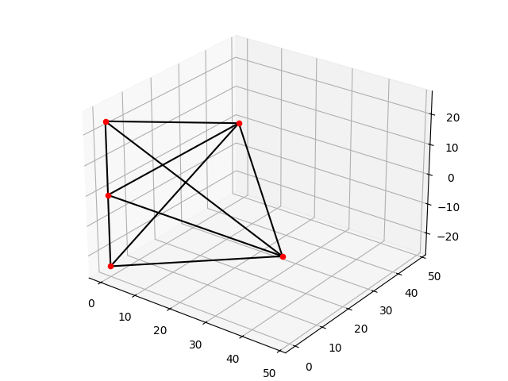

# PyFE
## Finite Element Analysis
### About
The finite element method is a numerical procedure that can be applied to obtain solutions to a variety of problems in engineering.
Steps:
  1. **Preprocessing Phase:**
     Subdivition of problem into nodes and elements, assuming shape functions, develop equations, assemble global stiffness matrix and apply boundary conditions.
  2. **Solution Phase:**
     Solve a set of linear or nonlinear algebraic equations simultaneously to obtain nodal results.
  3. **Postprocessing Phase:**
     Obtain the rest of relevant values e.g stresses. [1]



### Installation
Download source code
```bash
git clone https://github.com/FernandoLavarreda/PyFE
cd PyFE
```
Initialize environment. For example using venv
```bash
python3 -m venv venv
source ./venv/bin/activate
```
Install dependencies
```
python3 -m pip install -r requirements.txt
```

### Usage
See main code in elementos.py

Start by defining the nodes (x, y, name and if there is any limitation to their movement [X, Y| X, Y, Z | X,Y, rotation])
This depends on the elements being modeled
```python
nodes = [Node3DoF(0, 0, "A", (True, True, False)), Node3DoF(480, 0, "B"), Node3DoF(480, -160, "C"), Node3DoF(0, -400, "D", (True, False, False))]
```

Definition of Frame Elements (2D), young modulus, area, second moment of area and the nodes that make up each element. Node i, then j.
```python
elements = [ElementFrame(200, 480, 77e3, (nodes[0], nodes[1])), ElementFrame(200, 480, 77e3, (nodes[1], nodes[2])), ElementFrame(200, 480, 77e3, (nodes[2], nodes[3]))]
```

Create global stiffness matrix from the elements just created
```python
matrizg = global_matrixFrame(elements)
```

Create load matrix
Element 1 has a uniform load of 0.2N/mm and a triangular load of 0.2N/mm with a negative slope so it is especified as no ascendig
Element 2 has no load and has a point load 386.66mm from the node i of 250N
```python
load_matrix = load_elements(elements, [(UniformLoad(0.2), TriangleLoad(0.2,ascending=False)), (), (PointLoad(250, 386.66),)])
```

Obtain displacement and reaction, interpreting 3D dimention from the nodes as rotation freedom/restriction instead of movement in Z direction for this particular problem
```python
dis, reac = solve_matrix3D(matrizg, load_matrix, nodes)
```

Printing results
```python
coord = ["x", "y", "rot."]
units = ["mm", "mm", "rad"]
units2 = ["N", "N", "N-mm"]
print("-"*22+"Displacements"+"-"*22)
for i in range(1, len(dis)+1):
    print(f"Displacement from the node {nodes[(i-1)//3].name} en {coord[(i-1)%3]} es:\t\t\t{dis[i-1][0]} {units[(i-1)%3]}")
print("-"*60)
print("-"*25+"Reacciones"+"-"*25)
for i in range(1, len(reac)+1):
    print(f"Reaction form node {nodes[(i-1)//3].name} en {coord[(i-1)%3]} es:\t\t\t{reac[i-1][0]} {units2[(i-1)%3]}")
```

### Literature
[1.] Moaveni, Saeed. Finite Element Analysis: Theory and Application with ANSYS. 4. ed., Global edition, Pearson, 2015. 
